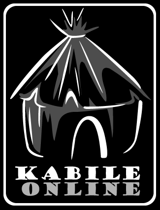

# 

> ### A massive multiplayer browser-based online strategy game project.

Project demo is available at (https://kabileonline.com/)

# Used Technologies

* [Node](https://nodejs.org/)
* [Mysql](https://mysql.com/)
* [Sequelize](https://sequelize.com/)
* [Express](https://github.com/expressjs/express) - The server for handling and routing HTTP requests
* [Express-jwt](https://github.com/auth0/express-jwt) - Middleware for validating JWTs for authentication
* [Jsonwebtoken](https://github.com/auth0/node-jsonwebtoken) - For generating JWTs used by authentication
* [Passport](https://github.com/jaredhanson/passport) - For handling user authentication

# Getting started

To get the Node server running locally:
``` bash
# to install all required dependencies
> npm install
# to start the local server
> npm run dev
```

## Application Structure

- `app.js` - The entry point to our application. This file defines our express server. It also requires the routes and models we'll be using in the application.
- `config/` - This folder is central location for configuration/environment variables.
- `routes/` - This folder contains the route definitions for our API.
- `helpers/` - This folder contains the misc helper/utility methods and classes.
- `models/` - This folder contains the schema definitions for our sequelize models. Returns db connection.

## Authentication

Requests are authenticated using the `Authorization` header with a valid JWT. We define two express middlewares in `helpers/auth.js` that can be used to authenticate requests. The `required` middleware configures the `express-jwt` middleware using our application's secret and will return a 401 status code if the request cannot be authenticated. The payload of the JWT can then be accessed from `req.payload` in the endpoint. The `optional` middleware configures the `express-jwt` in the same way as `required`, but will *not* return a 401 status code if the request cannot be authenticated.

# Authors

* [akjmgalp](https://github.com/thebilge)
* [metalsimyaci](https://github.com/metalsimyaci)

# License

This project is licensed under the MIT License - see the [LICENSE.md](LICENSE.md) file for details

See also the list of [contributors](https://github.com/KaOnStudio/kabileonline/contributors) who participated in this project.

# Acknowledgments

The KaOnStudio would like to thank to all the contributors to the project, and loves the players.
